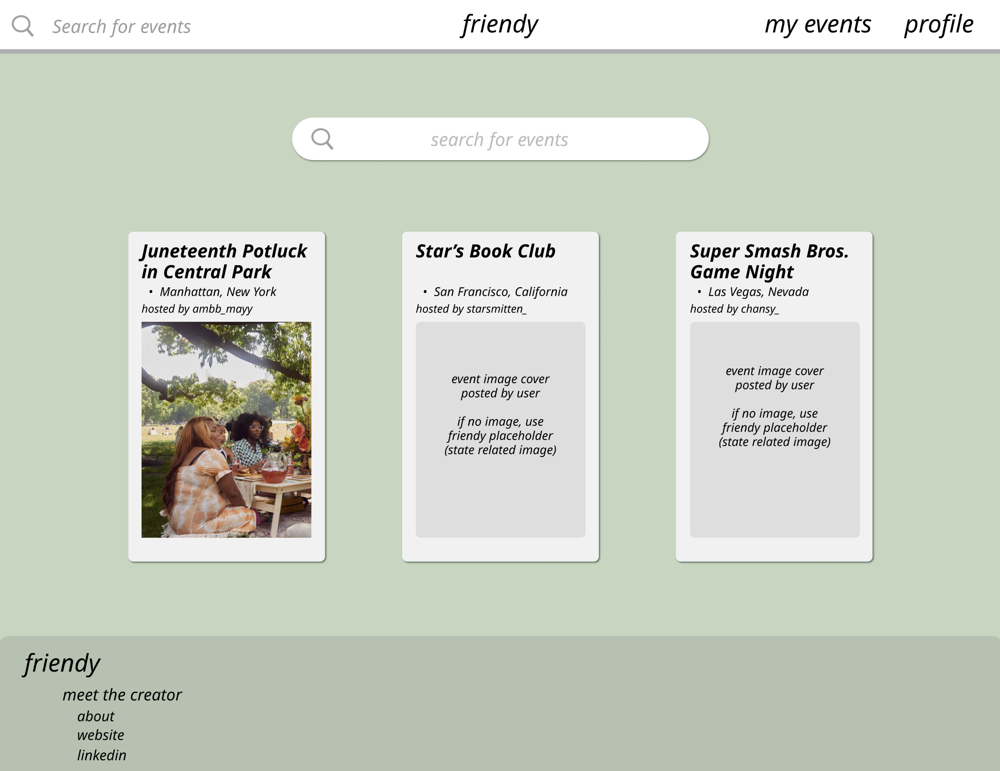
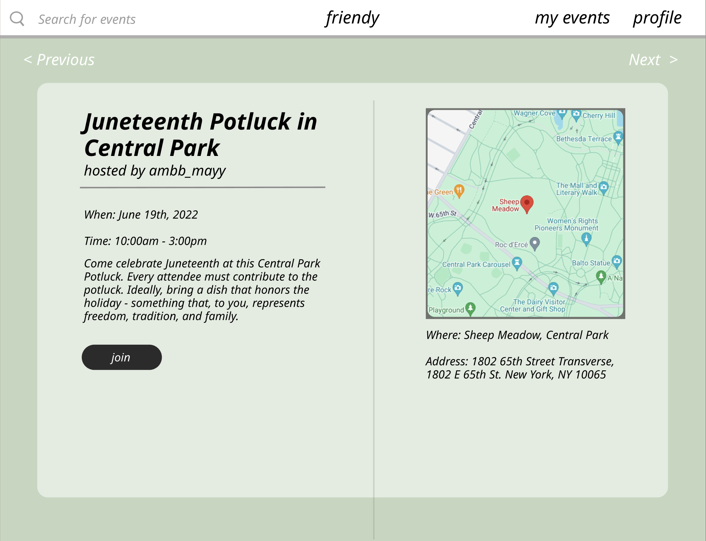
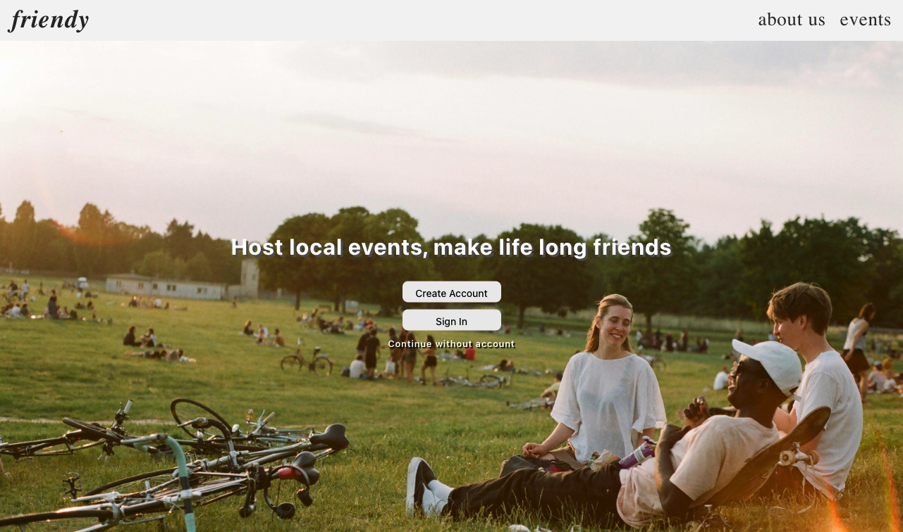
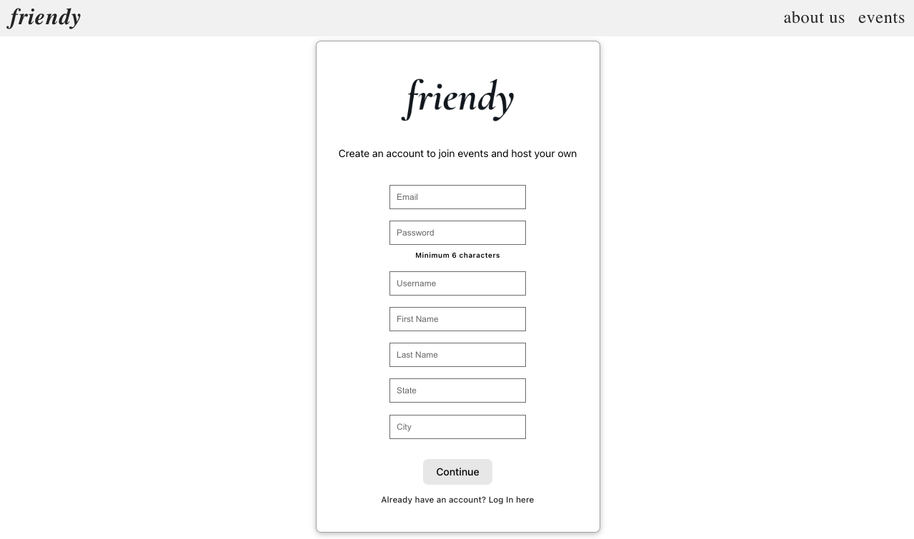
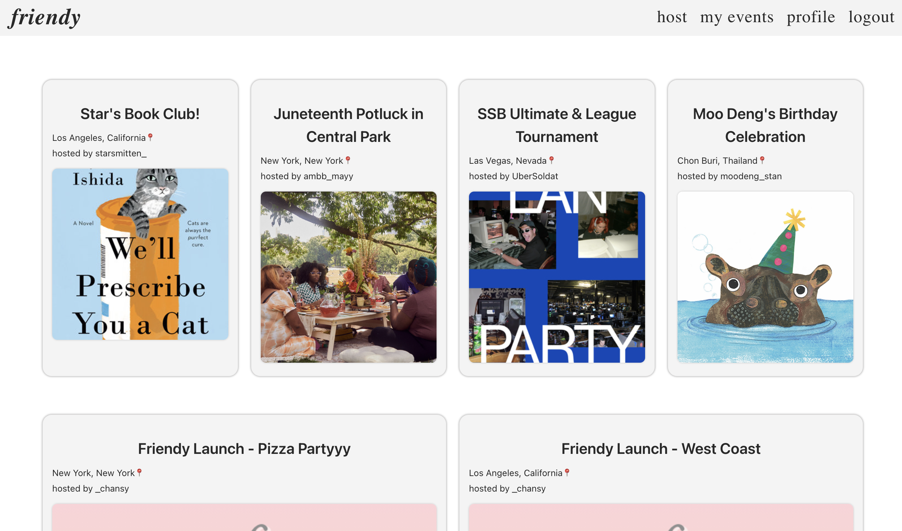

# Friendy

## Description
Friendy is an app all about creating events that bring people together based on shared interest. Through hosting events we create third spaces for the community to find new genuine relationships and bre

## Table of Contents
* [Technologies Used](#technologiesused)
* [Features](#features)
* [Design](#design)
* [Future Features](#nextsteps)
* [Deployed App](#deployment)
* [About the Author](#author)

## Technologies Used
* React
* Vite
* Spring Boot
* Spring Security
* Spring Session
* PostgreSQL
* Redis

## Features
Users can create a secure account with encrypted password.  
Users can login and out with changes made on the profile persist between sessions.  
Users can perform full CRUD functionality with events created by said user.  
Users can join events and view all joined and created events on a 'my events'. 
Users can deactivate their account. 

## Design
### Wireframes
Initial wireframes of the app.

### Current
Below is the current iteration of the apps design

## Future Features
Incorporate search function to filter through all events by name, location, event creator.  
Integrated blog meant to feature successful events and other related news.  
Profiles made public to all users for purposes of viewing hosting history and user achievements. 

## Deployed Link
Home Page: [Friendy.com]() Deployment in progress

Repository: [Github.com](https://github.com/casy1996/Friendy)

## About the Author:
Up and coming full-stack software developer with a passion for design and all things visual.
